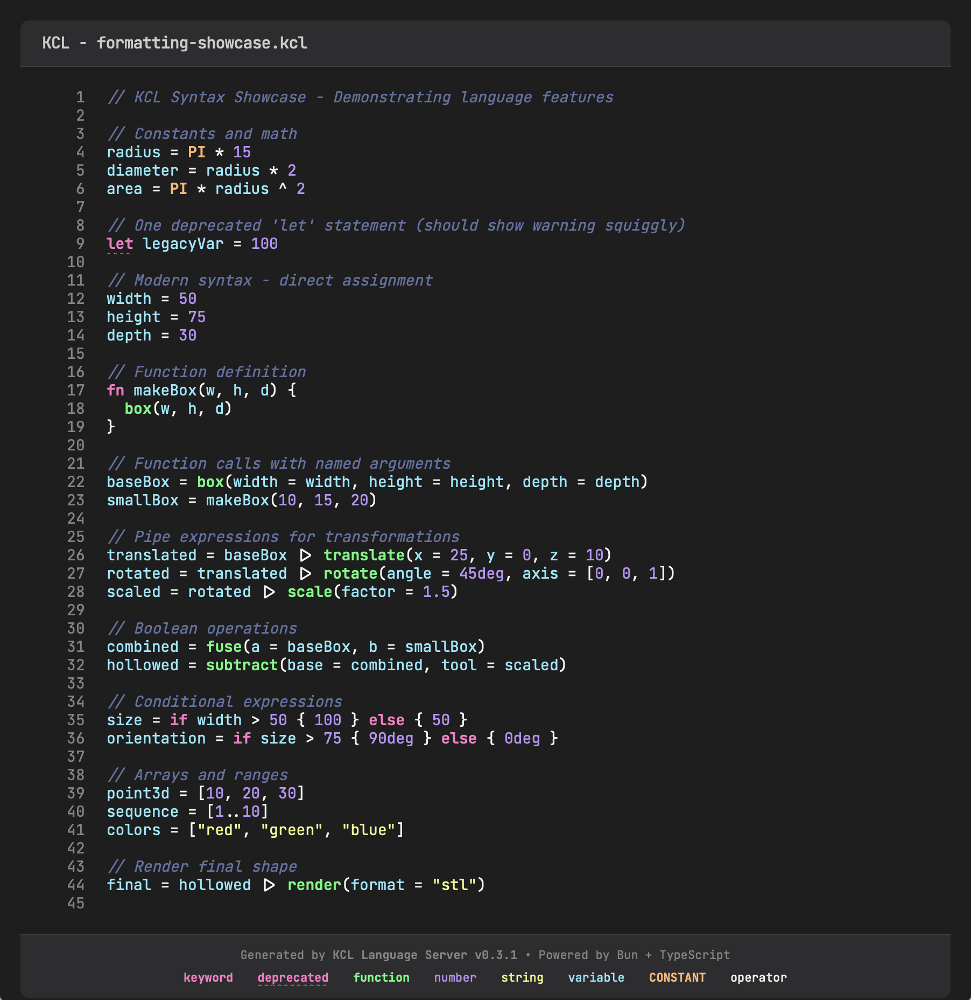

# KCL

TypeScript implementation of the [KittyCAD modeling language](https://kittycad.io). Built with Bun, zero dependencies.



## Components

- **Parser** - Lexer, parser, type checker (`src/kcl-lang/`)
- **LSP** - Language server with autocomplete, diagnostics, hover, formatting (`src/kcl-lsp/`)
- **CLI Tools**:
  - Unified KCL toolchain (format, check)
  - Format to HTML with syntax highlighting
  - Output serialized AST as JSON

## LSP Setup

**VSCode** - Add to `.vscode/settings.json`:
```json
{
  "kcl.server": {
    "command": "bun",
    "args": ["path/to/src/kcl-lsp/server.ts"]
  }
}
```

**Neovim (LazyVim)** - Add to `~/.config/nvim/lua/config/autocmds.lua`:
```lua
-- KCL Filetype Detection
vim.filetype.add({
  extension = {
    kcl = "kcl",
  },
})

-- KCL Language Server
vim.api.nvim_create_autocmd("FileType", {
  pattern = "kcl",
  callback = function()
    vim.lsp.start({
      name = "kcl-lsp",
      cmd = { "bun", "/absolute/path/to/src/kcl-lsp/server.ts" },
      root_dir = vim.fn.getcwd(),
    })
  end,
})
```

Then restart Neovim and open any `.kcl` file. Verify with `:LspInfo`

## CLI Tools

### Unified KCL CLI

**Format code** (preserves comments, smart blank line handling):
```bash
# Format a single file (writes in-place)
bun src/kcl-lsp/kcl-cli.ts fmt examples/box.kcl

# Format multiple files with glob
bun src/kcl-lsp/kcl-cli.ts fmt "examples/*.kcl"

# Check formatting without writing (CI mode)
bun src/kcl-lsp/kcl-cli.ts fmt --check "src/**/*.kcl"
```

**Type check code**:
```bash
# Check for type errors
bun src/kcl-lsp/kcl-cli.ts check examples/box.kcl

# Check with pretty errors
bun src/kcl-lsp/kcl-cli.ts check examples/formatting-showcase.kcl

# Format and check
bun src/kcl-lsp/kcl-cli.ts check --format examples/box.kcl

# JSON output for tooling integration
bun src/kcl-lsp/kcl-cli.ts check --json examples/box.kcl
```

### Additional Tools

**Format to HTML** (syntax highlighting):
```bash
bun src/kcl-lsp/format-cli.ts --html examples/formatting-showcase.kcl > output.html
```

**Output AST as JSON**:
```bash
bun src/kcl-lang/cli.ts examples/box.kcl > ast.json
```
